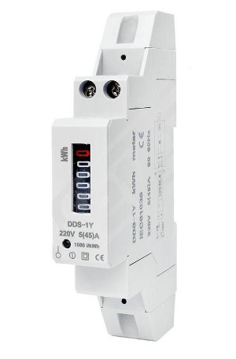

# An ESP32 based BLE beacon for energy meters with pulse output

An ESP32 based BLE beacon that counts pulses from an energy meter.

The program sends 8 bytes of data in BLE ManufacturerData about every 5 seconds. The data format is:

- 2 bytes of Manufacturer ID 0x02E5 (Espressif Inc)
- 2 bytes for identifying this sketch: 0xACDC (you know why :)
- 4 bytes of Wh total
- 4 bytes of Wh since last reset 
- 2 extra bytes as 0xBEEF because I could eat it every day

## Circuit

There are a lot of DIN rail installable energy meters that have a pulse output of 1000 impulses
per kWh or eg. 2000 impulses per kWh. Just connect your ESP32's GND to such meter's SO- and
GPIO13 to SO+

Install a reset button switch between GND and GPIO15

There are several defines in the beginning of the sketch, so eg. the pulse factor can be set.

## How it works

This program stores the total watt hours to ESP32's NVS every minute (configurable) if it has changed.
Theoretically once a minute saving should let the flash work at least 60 years before maximum write
cycles will be reached.

If the button is pressed more than 5 seconds, the board's LED will blink 5 times and then the program
saves the pulse count at the moment to the NVS. Just like resetting a trip meter in a car.

Theoretically it could be possible to calculate momentary power consumption, but in practice those
calculations will never give very accurate values. That kind of energy meters are designed to measure
accurate energy consumption, not momentary power. If you want to build an accurate power meter, the 
[Open Energy Monitor](https://learn.openenergymonitor.org/electricity-monitoring/ctac/how-to-build-an-arduino-energy-monitor)
could be the good one to start with.

### An example picture of a suitable energy meter

